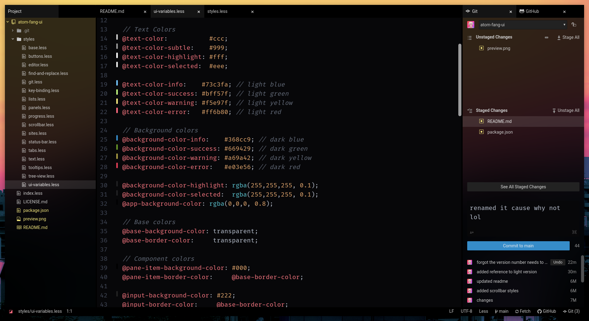

# Fang UI theme

A clean dark theme for Atom. Parts of it are transparent which require you to [modify the BrowserWindow object](https://github.com/katacarbix/dotfiles#atom) in Atom's source to take advantage of. Looks best with blurring which needs to be enabled in your environment's compositor.

[Check out the light companion theme!](https://github.com/katacarbix/wave-ui)
